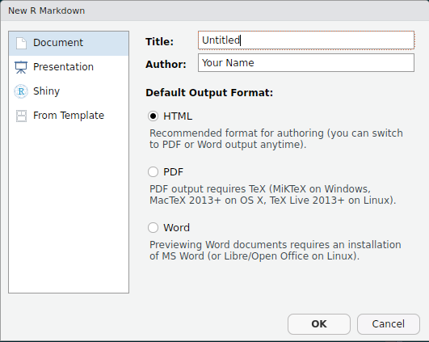

```{r setup, include=FALSE}
knitr::opts_chunk$set(echo = TRUE)
```

# Introduction

When we write a paper, or we produce slides for a conference or notes for a course we usually want to put together the output generated with R -a figure or the result of some statistical model- and some text that describes this ouput. A lot of time we end up copy and paste from our statistial software to our favourite text editor. However, this process is very inefficient and not reproducible.    

R Markdown is an R package that allows you to integrate R code (and its ouput) with text to generate high quality reports in different formats (i.e. HTML, PDF, MS Word). The text is written using Markdown, a simple formatting syntax. 

This is an introductory guide to the use of R Markdown especially for the production of reproducible articles.  For a more thorough description of the features of R Markdown see <http://rmarkdown.rstudio.com> and [R Markdown: The Definitive Guide](https://bookdown.org/yihui/rmarkdown/). You may also find the following cheatsheet and reference guide really helpful [The R Markdown Cheatsheet](https://www.rstudio.com/wp-content/uploads/2016/03/rmarkdown-cheatsheet-2.0.pdf), [The R Markdown Reference Guide](https://www.rstudio.com/wp-content/uploads/2015/03/rmarkdown-reference.pdf)

There are a large number of tasks that you could do with R Markdown:

- Compile a single R Markdown document to a report in different formats, such as PDF, HTML, or Word.

- Create notebooks in which you can directly run code chunks interactively.

- Make slides for presentations (HTML5, LaTeX Beamer, or PowerPoint).

- Produce dashboards with flexible, interactive, and attractive layouts.

- Build interactive applications based on [Shiny](https://shiny.rstudio.com/).

- Write journal articles.

- Author books of multiple chapters.

- Generate websites and blogs.

## Installation

It is strongly reccomended to use [RStudio](https://www.rstudio.com/), even if it is not required, because it makes it easier to work with R Markdown. Then install the `rmarkdown` package in R:

```{r install, eval=FALSE}
install.packages("rmarkdown")
```

If you want to generate PDF output, you will need to install LaTeX. For R users who have not installed LaTeX before, a quick solution is to install [TinyTeX](https://yihui.name/tinytex/):

```{r tinytex, eval=FALSE}
install.packages("tinytex")
tinytex::install_tinytex()
```

## Get Started

In RStudio, open a new R Markdown file. 

```{r screen1, echo=FALSE, out.width="70%"}

```

In the dialog box that appears, select the output format and write the Title and Author. These last two sections can be stated also later. If you have installed some specific packages that includes other rmarkdown templates you will fin them in the **From Template** tab.

```{r screen2, echo=FALSE, out.width="70%"}

```

An Rmd file appears with front matter and some sample text. You can know start to write some text and add chunks of R code. The figure below shows the standard format and the 3 main parts of an Rmd file:

- A YAML header where you can specify general formatting options for the entire document.
- R code chunks, these contain your R code and they have an header where it is possible to specify a series of option such as weather to show the code or not, how to treat figures produced by your output and so on.
- Text mixed with simple text formatting.

```{r rmd_file_ex, echo=FALSE}

```

When you click the **Knit** button a document will be generated that includes both content as well as the output of any embedded R code chunks within the document. When you click this magic button a lot of things happen under the hood. These are described in the figure below.

```{r knit, echo=FALSE}

```

R Markdown feeds the .Rmd file to [knitr](https://yihui.name/knitr/) which executes all of the code chunks and creates a new markdown (.md) document which includes the code and it’s output. Then markdown file generated by knitr is then processed by [pandoc](http://pandoc.org/) which is responsible for creating the finished format.

# Including R code

All the R code goes in what is called a *chunk*. You can quickly insert chunks with the keyboard shortcut **Ctrl + Alt + I**  or with the Inser chunk button in the editor toolbar.

## Chunk options

In the header of an R chunk it is possible to specify [knitr options](https://yihui.name/knitr/options/) to customise the your output. This can be specified separately for each R chunk or you could set global options that apply to every chunk in your file calling `knitr::opts_chunk$set` in a code chunk as in the example below.

This makes it easy to update the report

```` markdown
Thi is a code chunk where I set up global options:

`r ''````{r}
knitr::opts_chunk$set(echo = TRUE)
```
````

See the [R Markdown Reference Guide](https://www.rstudio.com/wp-content/uploads/2015/03/rmarkdown-reference.pdf) for a complete list of knitr chunk options. 

## Inline R code

Code results can be inserted directly into the text of a .Rmd file by enclosing the code with ``` `r ` ```.

# Including Figures

By default, figures produced by R code will be placed immediately after the code chunk they were generated from. For example:

```{r fig1}
plot(iris$Sepal.Length, iris$Sepal.Width, xlab = "Sepal Length", ylab = "Sepal Width")
```

You can provide a figure caption using `fig.cap` in the chunk options. See the example below.

```{r fig2, fig.cap="My scatterplot"}
plot(iris$Sepal.Length, iris$Sepal.Width, xlab = "Sepal Length", ylab = "Sepal Width")
```

In the case of PDF output, such figures will be automatically numbered. If you also want to number figures in other formats (such as HTML), please see the [`bookdown`](https://bookdown.org/yihui/bookdown/) package.

To place multiple figures side-by-side from the same code chunk, you can use the `fig.hold='hold'` option along with the `out.width` option. The figure below shows an example with two plots, each with a width of `50%`.

```{r hold-position, fig.cap='Two plots side-by-side.', fig.show='hold', out.width='50%', fig.width=5, fig.height=4}
plot(iris$Sepal.Length, iris$Sepal.Width, xlab = "Sepal Length", ylab = "Sepal Width")
plot(iris$Petal.Length, iris$Petal.Width, xlab = "Petal Length", ylab = "Petal Width")
```

If you want to include a graphic that is not generated from R code, you may use the `knitr::include_graphics()` function, which gives you more control over the attributes of the image than the Markdown syntax of `` (e.g., you can specify the image width via `out.width`).

# Including Tables

The easiest way to include tables is by using `knitr::kable()`, which can create tables for HTML, PDF and Word outputs. You may also consider the **pander** package. There are several other packages for producing tables, including **xtable**, **Hmisc**, and **stargazer**, but these are generally less compatible with multiple output formats. Table captions can be included by passing `caption` to the function, e.g.,

```` markdown
`r ''```{r}
knitr::kable(iris[1:4, ], caption = "My table.")
```
````

```{r table1, echo=FALSE}
knitr::kable(iris[1:4, ], caption = "My table.")
```

Tables in non-LaTeX output formats will always be placed after the code block.
If you are looking for more advanced control of the styling of tables, you are recommended to use the [**kableExtra**](https://cran.r-project.org/package=kableExtra) package, which provides functions to customize the appearance of PDF and HTML tables. 

To have some extra features for word table I suggest to have a look at the [`flextable`](https://davidgohel.github.io/flextable/) package and at [these slides](https://dmyee.files.wordpress.com/2016/03/table_workshop.pdf).

# Math expressions

Inline LaTeX equations can be written in a pair of dollar signs using the LaTeX syntax, e.g., `$f(x) = x^2$` and the actual ouput will be $f(x) = x^2$. 

Math expressions of the display style can be written in a pair of double dollar signs, e.g., `$$Y_i = \alpha + \beta X_i + \epsilon_i$$`, and the output will be shown as:

$$Y_i = \alpha + \beta X_i + \epsilon_i$$

# Adding bibliography

In order add citations and a bibliography at the end of your document you will need to specify a bibliography file using the  `bibliography` field in the YAML metadata section. For example:

``` yaml
--- 
title: "Sample Document"
output: pdf_document
bibliography: bibliography.bib
---
```

Bibliographies will be placed at the end of the document. Normally, you will want to end your document with an appropriate header:

``` markdown
last paragraph...

# References
``` 
Citations go inside square brackets and are separated by semicolons. Each citation must have a key, composed of ‘@’ + the citation identifier from the bibliography file, and may optionally have a prefix, a locator, and a suffix. Here are some examples:

``` markdown
Blah blah [see @cla99]. # Single citation

Blah blah [@cla99; @duncan2012]. # Double citation

@cla99 shows that... # in-text citation
``` 

You can also change the citation style adding a .csl file in the `csl` field in the YAML. More about bibliography and citations can be found [here](https://rmarkdown.rstudio.com/authoring_bibliographies_and_citations.html).

# Writing articles from a specific template

## Using your template

It is possible to provide a tempalte file for your document in the YAML and knitr will format your final document according to your tempalte. The specific tempalte will change based on the type of document that you want to produce, for example:

- for HTML documents you can change the general style (i.e font, color, font size and so on) adding a .css file in the css field as shown below.
``` yaml
---
title: "Sample document"
output:
  html_document:
    css: style.css
---
```
- for PDF there is a `template` field, here you can provide a .tex file:
``` yaml
---
title: "Sample document"
output:
  pdf_document:
    template: mytemplate.tex
---
```
- for Word you canl provide a .docx file in the `reference_docx` argument. 
``` yaml
---
title: "Habits"
output:
  word_document:
    reference_docx: my-styles.docx
---
```

## Using the `rticles` package

The `rticles` package is designed to simplify the creation of documents that conform to submission standards. A suite of custom R Markdown templates for popular journals is provided by the package. At the moment of writing the templates for the following articles are available:

- JSS articles (Journal of Statistical Software)
- R Journal articles
- CTeX documents
- ACM articles (Association of Computing Machinery)
- ACS articles (American Chemical Society)
- AMS articles (American Meteorological Society)
- PeerJ articles
- Elsevier journal submissions
- AEA journal submissions (American Meteorological Society)
- IEEE Transaction journal submissions
- Statistics in Medicine journal submissions
- Royal Society Open Science journal submissions
- Bulletin de l'AMQ journal submissions
- MDPI journal submissions
- Springer journal submissions

You can also retrieve the full list of templates through the command `getNamespaceExports("rticles")`. To use one of these temapltes you first nee to install the `rticles` package from CRAN as follows:

```{r, eval = FALSE}
# Install from CRAN
install.packages("rticles")

# Or install development version from GitHub
devtools::install_github("rstudio/rticles")
```

The development version of the package from GitHub, as it contains the most up-to-date versions along with several new templates. If you are using RStudio, you can easily access the templates through `File -> New File -> R Markdown`. This will open the dialog box where you can select from one of the available templates.