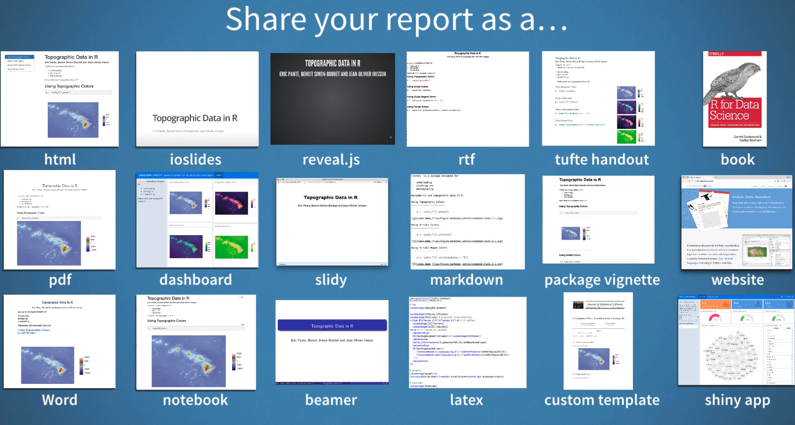

```{r setup, include=FALSE}
options(htmltools.dir.version = FALSE)
```

class: inverse, center, middle

# Introduction

---

## Reproducible research

There are serverl aspects of a research project that make it fully reproducible:

- Organising your project.
- Programming.
- Reproducible reports and papers.
- Version control.
- Archiving.

You can read [A Guide to Reproducible Code in Ecology and Evolution](https://www.britishecologicalsociety.org/wp-content/uploads/2017/12/guide-to-reproducible-code.pdf) for a very good and concise introduction to all these topics.

Today we will focus on how to generate **reproducible reports and papers with R**.

---
class: inverse, center, middle

# A non reproducible workflow...

---
<iframe width="100%" height="100%" src="https://www.youtube.com/embed/s3JldKoA0zw?rel=0" frameborder="0" allow="autoplay; encrypted-media" allowfullscreen></iframe>
---
class: inverse, center, middle

# The solution: Rmarkdown
---
## Rmarkdown

R Markdown is an R package that allows you to integrate R code (and its ouput) with text to generate high quality reports in different formats (i.e. HTML, PDF, MS Word). The text is written using Markdown, a simple formatting syntax. 

The best reference currently aviable is this book [R Markdown: The Definitive Guide](https://bookdown.org/yihui/rmarkdown/).

---
## A wide range of possible outputs

```{r, echo=F}

```

---